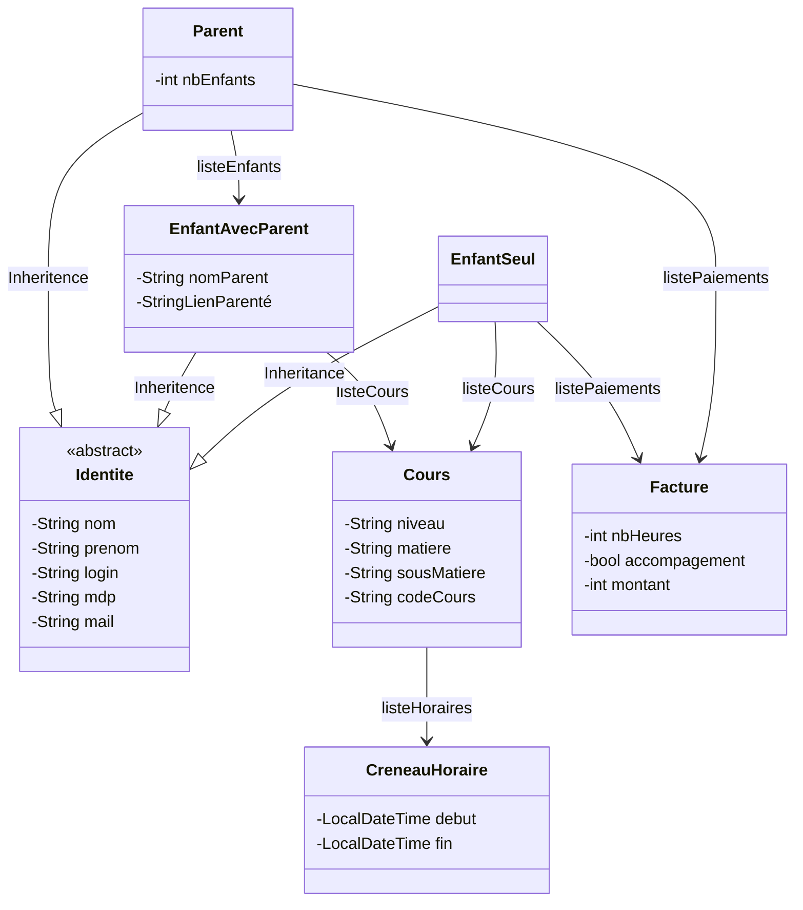

# projetAndroid

# Diagrams

```mermaid
classDiagram

 class Identite{
 <<abstract>>
 -String nom
 -String prenom
 -String login
 -String mdp
 -String mail
 }
 
 class Cours{
 -String niveau
 -String matiere
 -String sousMatiere
 -String codeCours
 }
 Cours --> CreneauHoraire : listeHoraires
 
 class CreneauHoraire{
 -LocalDateTime debut
 -LocalDateTime fin

 }

 
 class Parent{
 -int nbEnfants
 }
 
 Parent --> EnfantAvecParent : listeEnfants
 Parent --> Facture : listePaiements
 
 class Facture{
 -int nbHeures
 -bool accompagement
 -int montant
 }
 
 class EnfantSeul{
 
 }
 EnfantSeul --> Facture : listePaiements
 EnfantSeul --> Cours : listeCours

 
 class EnfantAvecParent{
 -String nomParent
 -StringLienParenté
 }
 EnfantAvecParent --> Cours : listeCours

 
 EnfantSeul --|> Identite:Inheritance
 EnfantAvecParent --|> Identite :Inheritence
 Parent --|> Identite :Inheritence

 
 
```
