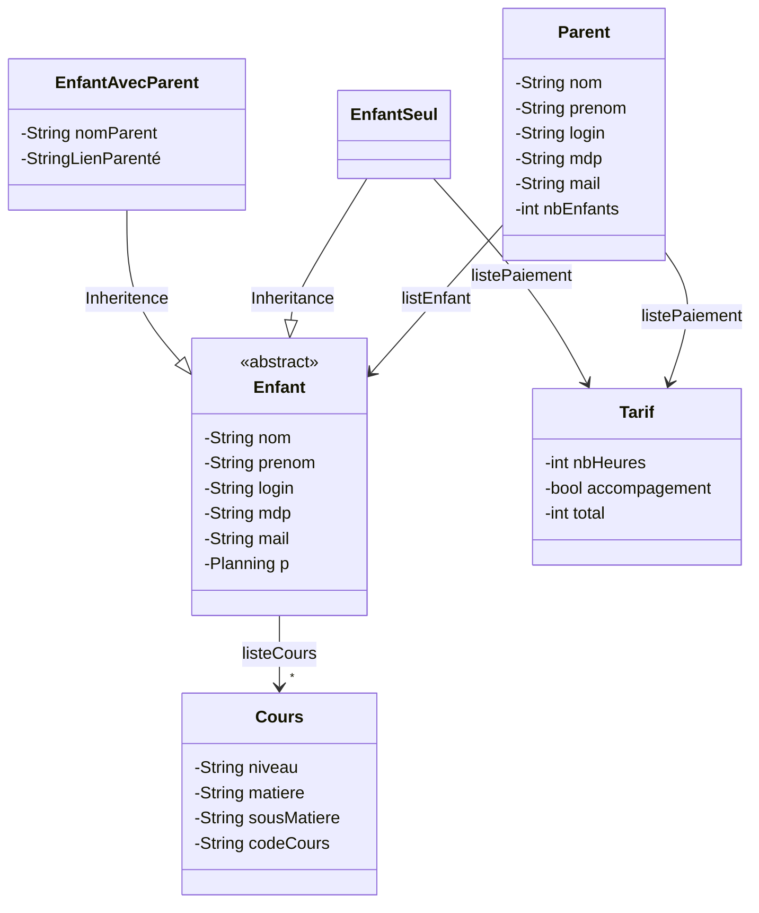

# projetAndroid

# Diagrams

```mermaid
classDiagram

 class Enfant{
 <<abstract>>
 -String nom
 -String prenom
 -String login
 -String mdp
 -String mail
 -Planning p
 }
 Enfant --> "*" Cours : listeCours
 
 class Cours{
 -String niveau
 -String matiere
 -String sousMatiere
 -String codeCours
 }
 
 class Parent{
 -String nom
 -String prenom
 -String login
 -String mdp
 -String mail
 -int nbEnfants
 }
 Parent --> Enfant : listEnfant
 Parent --> Tarif : listePaiement
 
 class Tarif{
 -int nbHeures
 -bool accompagement
 -int total
 }
 
 class EnfantSeul{
 
 }
 EnfantSeul --> Tarif : listePaiement
 
 class EnfantAvecParent{
 -String nomParent
 -StringLienParenté
 }
 
 EnfantSeul --|> Enfant:Inheritance
 EnfantAvecParent --|> Enfant :Inheritence
 
```
