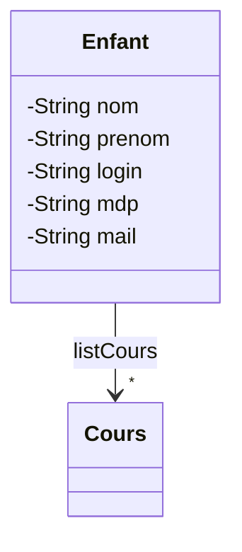

# projetAndroid

# Diagrams

```mermaid
classDiagram

 class Enfant{
 -String nom
 -String prenom
 -String login
 -String mdp
 -String mail
 }
 Enfant --> "*" Cours : listCours
 
 class Cours{
 }
 
```
